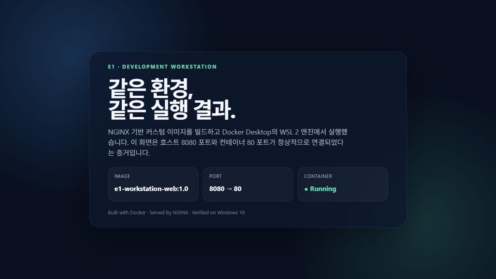
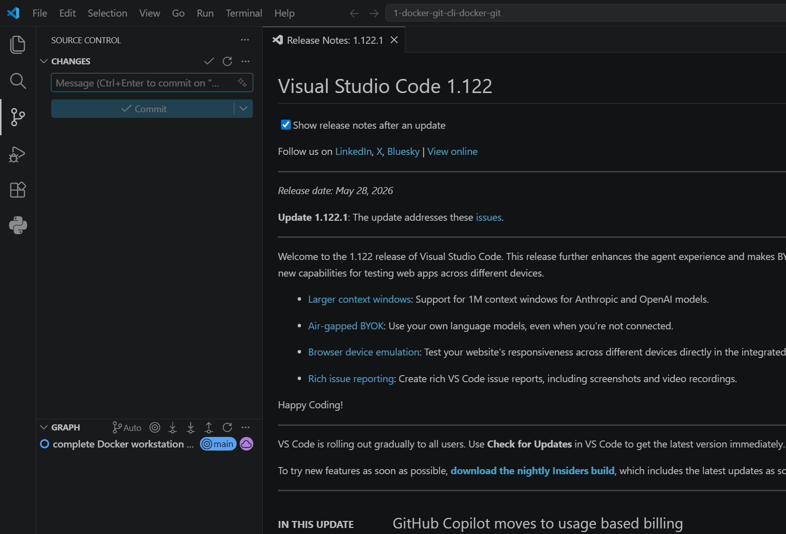

# E1 Docker Development Workstation

Windows 10, PowerShell, Docker Desktop(WSL 2), Git/GitHub을 연결해 **재현 가능한 개발 워크스테이션**을 구축한 결과물입니다. Linux CLI와 권한을 실습하고, NGINX 웹 서버를 커스텀 이미지로 빌드했으며, 포트 매핑·바인드 마운트·named volume의 동작을 실제 명령 출력으로 검증했습니다.



> 접속 주소: `http://localhost:8080/`
> 브라우저 검증: URL, 제목, 본문 상태를 확인했고 viewport/scroll width가 모두 `1280`임을 확인했습니다. [브라우저 검증 로그](evidence/logs/11-browser-validation.txt)와 [HTTP 200/curl 로그](evidence/logs/06-build-port-health.txt)를 함께 증거로 사용합니다.

## 1. 프로젝트 구조

```text
.
├── app/index.html                  # 커스텀 정적 웹페이지
├── bind-demo/index.html            # 바인드 마운트 변경 반영 실습 파일
├── nginx/default.conf              # NGINX 설정과 /health 엔드포인트
├── scripts/                        # 재현 가능한 Linux CLI 실습 스크립트
├── evidence/
│   ├── logs/                       # 실제 명령과 출력
│   └── screenshots/                # 포트 접속 등 시각 증거
├── Dockerfile
├── .dockerignore
├── .gitignore
└── README.md
```

## 2. 실행 환경

| 항목 | 실제 환경 |
|---|---|
| OS | Windows 10 Pro 22H2, build 19045.6466, x86_64 |
| 터미널/셸 | PowerShell 5.1 |
| Linux 실행 환경 | Docker Desktop + WSL 2.7.11, kernel `6.18.33.2-microsoft-standard-WSL2` |
| Docker | Docker Desktop / Client·Server `29.7.2` |
| Git | `2.54.0.windows.1` |
| 웹 서버 | `nginx:alpine` (`nginx/1.31.3`) |

전체 출력은 [환경 로그](evidence/logs/01-environment.txt)에 있습니다.

```console
$ docker --version
Docker version 29.7.2, build a7dcaa6

$ docker info --format ...
Server Version: 29.7.2
Operating System: Docker Desktop
Kernel Version: 6.18.33.2-microsoft-standard-WSL2
OS/Arch: linux/x86_64

$ git --version
git version 2.54.0.windows.1
```

## 3. 수행 체크리스트

- [x] 현재 위치, 숨김 파일 포함 목록, 이동 확인
- [x] 파일/디렉터리 생성, 내용 확인, 빈 파일 생성
- [x] 복사, 이동·이름 변경, 삭제
- [x] Linux 파일 1개와 디렉터리 1개의 권한 변경 전·후 비교
- [x] Docker 버전과 데몬(서버) 동작 확인
- [x] 이미지 다운로드 및 `docker images`
- [x] 컨테이너 실행·중지·재시작 및 `docker ps`, `docker ps -a`
- [x] `docker logs`, `docker stats --no-stream`
- [x] `hello-world` 성공
- [x] Ubuntu 내부 명령과 `run`/`exec`/중지·재시작 관찰
- [x] Dockerfile 기반 커스텀 NGINX 이미지 빌드
- [x] `-p 8080:80` 포트 매핑과 HTTP 200 확인
- [x] 바인드 마운트 변경의 즉시 반영 확인
- [x] named volume의 컨테이너 삭제 전·후 데이터 유지 확인
- [x] Git 작성자, noreply 이메일, 기본 브랜치 `main` 설정
- [x] GitHub 원격 저장소 연결
- [x] VS Code Source Control에서 `main` 커밋과 clean 상태 확인
- [x] 민감정보 패턴 검사

## 4. 검증 방법과 증거 위치

| 검증 항목 | 핵심 명령 | 결과 |
|---|---|---|
| 환경 | `docker --version`, `docker info`, `git --version` | [01-environment.txt](evidence/logs/01-environment.txt) |
| 터미널 조작 | `pwd`, `ls -la`, `touch`, `cat`, `cp`, `mv`, `rm` | [02-terminal-operations.txt](evidence/logs/02-terminal-operations.txt) |
| 권한 | `chmod`, `stat` | [03-permissions.txt](evidence/logs/03-permissions.txt) |
| hello-world/운영 | `docker run`, `images`, `ps -a`, `logs`, `stats` | [04-hello-world-and-operations.txt](evidence/logs/04-hello-world-and-operations.txt) |
| Ubuntu | `docker run`, `exec`, `stop`, `start` | [05-ubuntu-container.txt](evidence/logs/05-ubuntu-container.txt) |
| 빌드/포트/헬스 | `docker build`, `-p 8080:80`, `curl`, `logs`, `stats` | [06-build-port-health.txt](evidence/logs/06-build-port-health.txt) |
| 바인드 마운트 | `--mount type=bind`, 변경 전·후 `curl` | [07-bind-mount.txt](evidence/logs/07-bind-mount.txt) |
| 볼륨 영속성 | `docker volume`, 컨테이너 삭제 전·후 `cat` | [08-volume-persistence.txt](evidence/logs/08-volume-persistence.txt) |
| 최종 운영 상태 | `images`, `ps`, `ps -a`, `logs`, `stats`, `volume ls` | [09-final-docker-state.txt](evidence/logs/09-final-docker-state.txt) |
| Git/GitHub/VS Code | `git config --list`, `git remote -v`, Source Control | [Git 로그](evidence/logs/10-git-config-and-remote.txt), [VS Code 캡처](evidence/screenshots/vscode-git-integration.png) |
| 브라우저 | URL/제목/본문/overflow 및 스크린샷 | [11-browser-validation.txt](evidence/logs/11-browser-validation.txt) |
| 보안/문서 | 공백·상대 링크·비밀정보 패턴 검사 | [12-security-check.txt](evidence/logs/12-security-check.txt) |

## 5. Linux CLI와 경로

Windows 호스트 위에서 POSIX 권한을 정확히 검증하기 위해 `alpine:3.22`의 Linux 파일시스템에서 실습했습니다. 셸 스크립트는 [terminal-lab.sh](scripts/terminal-lab.sh)에 있습니다.

```console
$ pwd
/
$ mkdir -p /lab/source
$ touch source/empty.txt
$ echo "hello terminal" > source/sample.txt
$ cat source/sample.txt
hello terminal
$ cp source/sample.txt copied.txt
$ mv copied.txt renamed.txt
$ mkdir moved && mv source/sample.txt moved/renamed-sample.txt
$ rm renamed.txt && rm -rf moved source
```

- **절대 경로**는 루트부터 대상을 모두 적습니다. 예: `/lab/source/sample.txt`.
- **상대 경로**는 현재 디렉터리를 기준으로 적습니다. `/lab`에서 `source/sample.txt`는 같은 파일을 가리킵니다.
- 절대 경로는 기준점이 명확하고, 상대 경로는 프로젝트를 다른 위치로 옮겨도 재사용하기 쉽습니다.

## 6. 파일 권한

Linux 권한은 소유자(user), 그룹(group), 그 외 사용자(other) 순으로 `rwx`를 표현합니다. 숫자는 `r=4`, `w=2`, `x=1`을 더해 계산합니다.

- `644` = `rw-r--r--`: 소유자는 읽기·쓰기, 나머지는 읽기
- `755` = `rwxr-xr-x`: 소유자는 모두 가능, 나머지는 읽기·실행(디렉터리 접근)

```console
$ chmod 600 /lab/permission-file.txt
-rw------- 600 /lab/permission-file.txt
$ chmod 644 /lab/permission-file.txt
-rw-r--r-- 644 /lab/permission-file.txt
$ chmod 700 /lab/permission-dir
drwx------ 700 /lab/permission-dir
$ chmod 755 /lab/permission-dir
drwxr-xr-x 755 /lab/permission-dir
```

전체 실습은 [permission-lab.sh](scripts/permission-lab.sh)와 [권한 로그](evidence/logs/03-permissions.txt)에서 확인할 수 있습니다.

## 7. Docker 기본 운영과 컨테이너

### hello-world

```console
$ docker run --name e1-hello hello-world
Hello from Docker!
This message shows that your installation appears to be working correctly.
```

이후 `docker images`, `docker ps`, `docker ps -a`, `docker logs e1-hello`, `docker stats --no-stream e1-hello`를 실행했습니다. 종료된 `hello-world`는 `docker ps`에는 없고 `docker ps -a`에는 `Exited (0)`으로 남았습니다.

### Ubuntu와 `run`/`exec`/`attach`

```console
$ docker run --name e1-ubuntu-once ubuntu:24.04 sh /scripts/ubuntu-once.sh
hello from ubuntu

$ docker run -d --name e1-ubuntu-live ubuntu:24.04 sleep infinity
$ docker exec e1-ubuntu-live sh /scripts/ubuntu-exec.sh
entered with docker exec
root
/
```

- `docker run`은 이미지로 **새 컨테이너**를 만들고 명령을 시작합니다.
- `docker exec`는 **이미 실행 중인 컨테이너**에 별도 프로세스를 추가합니다. `exec` 셸을 종료해도 메인 프로세스는 계속 실행됩니다.
- `docker attach`는 컨테이너의 **메인 프로세스 표준 입출력**에 직접 붙습니다. 입력이나 종료 신호가 메인 프로세스에 영향을 줄 수 있어 운영 확인에는 보통 `exec`가 안전합니다.
- `sleep infinity` 컨테이너는 `docker stop` 후 `Exited`가 되었고, `docker start` 후 같은 컨테이너에서 `docker exec ... echo restarted`가 성공했습니다.

## 8. 커스텀 NGINX 이미지

선택한 기존 베이스는 공식 `nginx:alpine` 이미지입니다. 작은 Alpine 기반 이미지에 정적 파일과 설정만 더하는 방식(A)을 사용했습니다.

커스텀 포인트:

1. `app/index.html`: 기본 NGINX 페이지를 미션 전용 반응형 화면으로 교체
2. `nginx/default.conf`: `/health` 엔드포인트와 보안 응답 헤더 추가
3. `HEALTHCHECK`: 컨테이너 내부에서 `wget`으로 웹 서버 상태 검사
4. OCI `LABEL`: 이미지 목적과 설명 기록
5. `.dockerignore`: Git·증거 파일 등 불필요한 빌드 컨텍스트 제외

```dockerfile
FROM nginx:alpine

COPY nginx/default.conf /etc/nginx/conf.d/default.conf
COPY app/ /usr/share/nginx/html/

EXPOSE 80

HEALTHCHECK --interval=10s --timeout=3s --start-period=3s --retries=3 \
  CMD wget -q -O /dev/null http://127.0.0.1/health || exit 1
```

```console
$ docker build --progress=plain -t e1-workstation-web:1.0 .
build exit code: 0
$ docker run -d --name e1-workstation-web -p 8080:80 e1-workstation-web:1.0
$ docker inspect --format 'Status={{.State.Status}} Health={{.State.Health.Status}}' e1-workstation-web
Status=running Health=healthy
```

이미지는 실행 설계도이고 컨테이너는 그 이미지의 실행 인스턴스입니다. 같은 이미지로 여러 컨테이너를 만들 수 있으며, 컨테이너를 삭제해도 이미지는 별도로 남습니다.

## 9. 포트 매핑

```console
$ docker run -d --name e1-workstation-web -p 8080:80 e1-workstation-web:1.0
$ docker ps --filter name=e1-workstation-web
... 0.0.0.0:8080->80/tcp ... e1-workstation-web
$ curl.exe -sS -i http://localhost:8080/health
HTTP/1.1 200 OK
...
healthy
```

컨테이너 네트워크는 호스트와 격리됩니다. `-p 8080:80`은 호스트의 `8080`으로 온 요청을 컨테이너의 NGINX `80`으로 전달하여 외부에서 접속할 수 있게 합니다.

## 10. 바인드 마운트 변경 반영

```powershell
$bindPath = (Resolve-Path bind-demo).Path
docker run -d --name e1-bind-web -p 8081:80 `
  --mount "type=bind,source=$bindPath,target=/usr/share/nginx/html,readonly" `
  nginx:alpine
```

재빌드와 재시작 없이 호스트 파일만 변경했습니다.

```console
$ curl.exe -s http://localhost:8081  # BEFORE
<body><h1>Bind mount version: BEFORE</h1></body>

# 호스트 bind-demo/index.html 수정, docker build/restart 없음
$ curl.exe -s http://localhost:8081  # AFTER
<body><h1>Bind mount version: AFTER — reflected without rebuild</h1></body>
```

바인드 마운트는 호스트 경로와 컨테이너 경로를 직접 연결하므로 개발 중 변경 확인에 유리합니다. 이번 실습은 `readonly`로 연결해 컨테이너에서 호스트 소스를 바꿀 수 없게 했습니다.

## 11. Docker volume 영속성

```console
$ docker volume create e1-workstation-data
$ docker run --name e1-volume-writer --mount source=e1-workstation-data,target=/data ...
WRITTEN BY FIRST CONTAINER:
persistent data survives container deletion

$ docker rm e1-volume-writer
e1-volume-writer

$ docker run --name e1-volume-reader --mount source=e1-workstation-data,target=/data ...
READ BY SECOND CONTAINER:
persistent data survives container deletion
```

첫 번째 컨테이너를 삭제한 뒤 같은 named volume을 두 번째 컨테이너에 연결해 동일한 `result.txt`를 읽었습니다. 컨테이너 생명주기와 volume 생명주기가 분리되므로 DB·업로드 파일처럼 유지해야 할 데이터를 저장할 수 있습니다.

## 12. Git과 GitHub 연동

개인 이메일 노출을 막기 위해 GitHub noreply 주소를 사용했습니다.

```console
$ git config --get user.name
juhyulee
$ git config --get user.email
juhyulee@users.noreply.github.com
$ git config --get init.defaultBranch
main
$ git remote -v
origin  https://github.com/juhyulee/E1-1.git (fetch)
origin  https://github.com/juhyulee/E1-1.git (push)
```

- **Git**: 로컬 파일의 변경 이력, 브랜치, 커밋을 관리하는 버전 관리 도구
- **GitHub**: Git 저장소를 원격에서 공유하고 리뷰·이슈·협업을 제공하는 플랫폼
- GitHub 인증은 Windows Git Credential Manager를 사용했으며 `git push -u origin main`이 성공했습니다.
- VS Code는 이 폴더를 Git 저장소로 인식하며, Source Control에서 변경 파일이 없는 clean 상태와 `main` 커밋 그래프를 확인했습니다.



## 13. 재현 방법

```powershell
git clone https://github.com/juhyulee/E1-1.git
cd E1-1

docker build -t e1-workstation-web:1.0 .
docker run -d --name e1-workstation-web -p 8080:80 e1-workstation-web:1.0

curl.exe http://localhost:8080/health
docker ps
docker logs e1-workstation-web
docker stats --no-stream e1-workstation-web
```

브라우저에서 <http://localhost:8080/>을 열어 같은 화면을 확인합니다.

## 14. 트러블슈팅

### 14.1 Docker Desktop `Wsl/ExecError`

- **문제:** Docker Desktop 시작 시 `wsl.exe --version: exit status 1` 발생
- **원인 가설:** Windows inbox WSL이 너무 오래되어 `--version` 옵션과 최신 Docker Desktop 요구사항을 충족하지 못함
- **확인:** 기존 `wsl --version`이 버전 대신 도움말을 표시했고, Windows 10 22H2 build 19045임을 확인
- **해결:** 관리자 권한으로 `wsl --install --no-distribution --web-download` 실행 후 재부팅
- **결과:** WSL `2.7.11`, Docker Server `29.7.2`, WSL 2 kernel `6.18.33.2`로 정상 실행

### 14.2 PowerShell에서 긴 `sh -c` 명령이 잘림

- **문제:** 인라인 Linux 명령의 따옴표와 공백이 PowerShell에서 먼저 해석되어 로그에 일부 단어만 출력됨
- **원인 가설:** PowerShell → Docker CLI → 컨테이너 `sh`의 다중 파싱 과정에서 인수 경계가 바뀜
- **확인:** 짧은 명령은 성공했으나 `echo`, `stat -c`가 포함된 긴 명령만 잘렸음
- **해결:** 명령을 [scripts](scripts/)의 `.sh` 파일로 분리하고 읽기 전용 바인드 마운트 후 `sh /scripts/...`로 실행
- **결과:** 모든 명령과 `644/755` 출력이 온전히 기록되고 재실행도 쉬워짐

### 14.3 BuildKit 진행 출력이 PowerShell 오류처럼 보임

- **문제:** 실제 빌드는 성공했지만 `#0 building with ...` 출력이 `NativeCommandError`로 표시됨
- **원인 가설:** BuildKit이 정상 진행 메시지를 stderr로 보내고 Windows PowerShell 5.1이 이를 오류 레코드로 래핑함
- **확인:** `docker images`에 이미지가 생성됐고 빌드 종료 코드가 `0`이었음
- **해결:** `cmd.exe /c "docker build ... 2>&1"`로 두 스트림을 합치고 `$LASTEXITCODE`를 검증
- **결과:** 정리된 빌드 로그와 `build exit code: 0` 확보

## 15. 보안 및 개인정보 보호

- GitHub 비밀번호, PAT, SSH 개인키, 인증 코드는 저장하지 않았습니다.
- 실제 이메일 대신 GitHub noreply 이메일을 사용했습니다.
- Docker/Git 로그에는 필요한 설정과 운영 결과만 포함했습니다.
- 커밋 전 `ghp_`, `github_pat_`, 비밀키 헤더, 일반적인 토큰/비밀번호 할당 패턴을 검사합니다.
- 토큰이 노출되면 문서에서 지우는 것만으로 끝내지 않고 토큰을 즉시 폐기·재발급하고 Git 이력에서도 제거해야 합니다.
